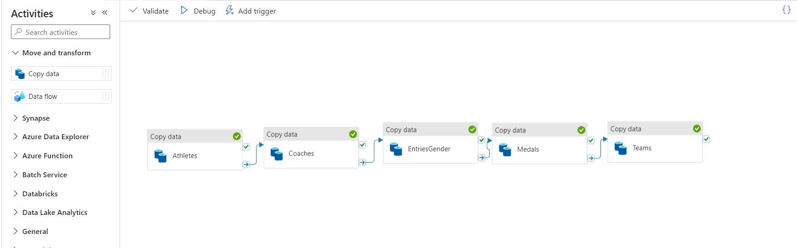
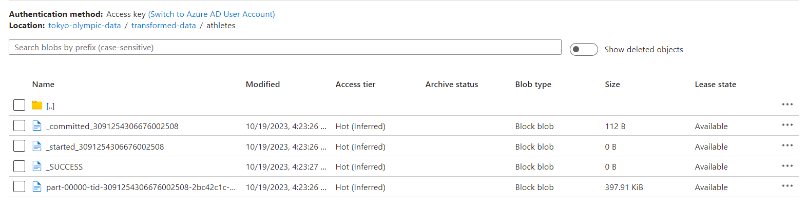
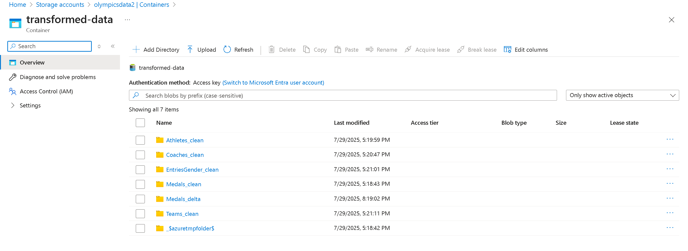
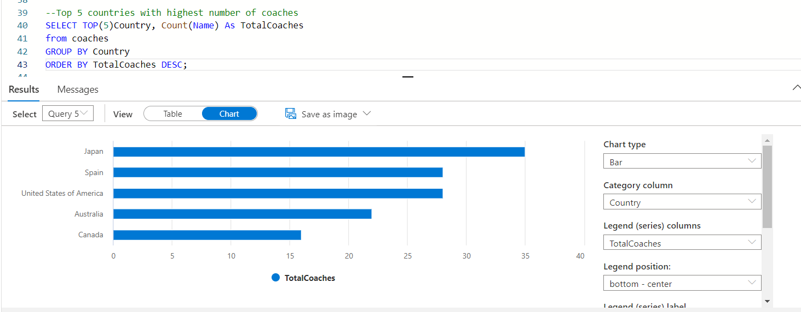

# 🏅 Tokyo Olympics 2021 Data Pipeline | Azure End-to-End Data Engineering Project

This project demonstrates how to build a modern data pipeline using **Azure Data Lake**, **Azure Data Factory**, **Azure Synapse Analytics**, and **Power BI** to analyze data from the **Tokyo Olympics 2021**. We ingest raw data from GitHub into Azure, transform it using ADF & Spark in Databricks, and finally visualize insights in Synapse or Power BI. It's designed to replicate real-world architecture using cloud-scale data tools.

---

## 🧱 Architecture


---

## 📁 Dataset

The dataset includes over **10,000 rows** of Olympic data containing athlete names, ages, sports, medals, and more. It's sourced from [Kaggle Tokyo Olympics Dataset](https://www.kaggle.com/datasets).

---

## 🛠️ Azure Services Used

- **Azure Data Lake Storage Gen2** — Store raw and transformed data
- **Azure Data Factory** — Ingest CSV files into storage using pipelines
- **Azure Synapse Analytics** — Create external tables and query data
- **Azure Databricks** *(optional)* — For transformation and testing via Spark
- **Power BI / Synapse Studio** — Build reports and dashboards

---

## ⚙️ Workflow Overview

### ✅ Initial Setup

1. Created a **storage account** and enabled hierarchical namespace
2. Created **containers**: `raw-data`, `transformed-data`
3. Uploaded Olympic datasets from GitHub to the raw container
4. Built an ADF pipeline to move and transform data
5. Created external tables in **Synapse Lake Database**
6. Queried and visualized using **Synapse Studio** and **Power BI**

---

## 🔄 Data Flow

### 📥 Raw Data Ingestion


### ⚙️ ADF Pipeline



---

## 💾 Transformed Data

### Container View



### Table View in Synapse



---

## 📊 Final Reports



---

## 🚀 Future Enhancements

- Add streaming data using Azure Event Hubs
- Implement row-level security in Power BI
- Automate the pipeline with triggers

---

## 📎 Project Structure

```bash
├── data/                      # Raw data files
├── Images/                   # Architecture and screenshot images
├── docs/                     # Documentation (optional)
├── README.md
└── .gitignore
